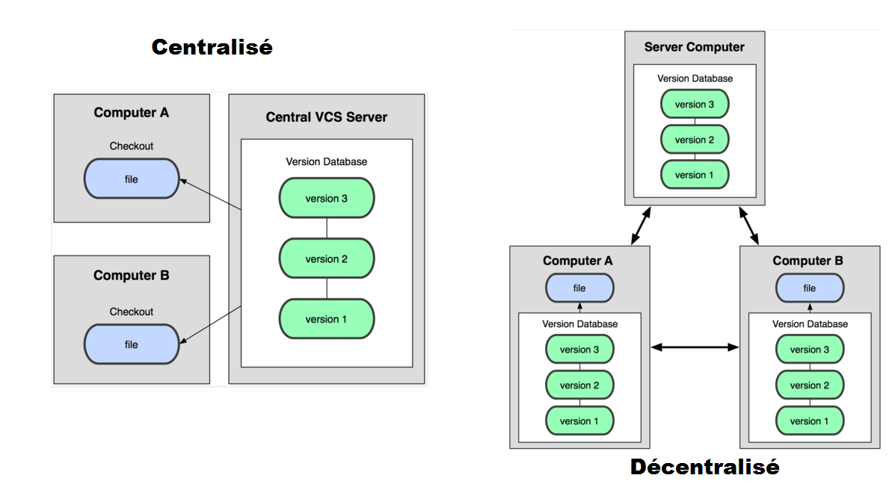
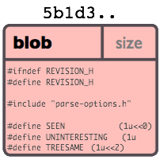
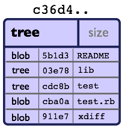
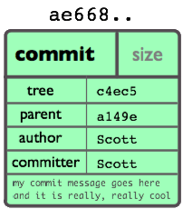
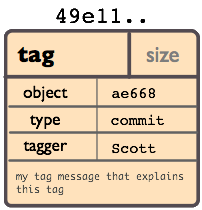
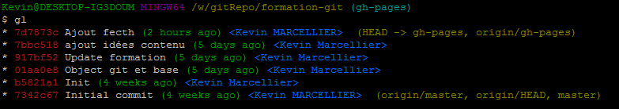
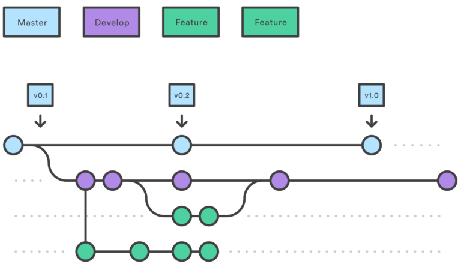

# Formation GIT

#  Kevin MARCELLIER

<i class="fab fa-github"></i> Dunska

<i class="fab fa-twitter"></i> Buck_LSN

Note:
* Apside depuis 7 ans
* Formation de formateur occasionnel
* Apsitech Git en 2016

# Objectifs

* Comprendre le fonctionnement général de GIT
* Savoir utiliser les commandes de bases de GIT
* Etre autonome sur GIT
* Connaitre les outils autour de GIT

Note:
* Confirmer les objectifs de chacun

# Plan de la Formation

- GIT, un SCM décentralisé
- Les objets GIT
- Les bases : Le staging et les commits
- Les commandes de bases
- Les remotes

# Plan de la Formation

- Les branches
- Jouer avec les commits
- Les commandes avancées
- La configuration
- Les IHM et outils

Note:
* Parler des pauses (dejeuner ensemble ?)
* Demander si il y a des contraintes d'horaires
* Méthode Une question => Une démo en live

# Tour de table

Note:
* Auto-évaluation Git
* Commiter open-source ?
* __On fait le questionnaire !__

====

# Git, c'est quoi ?

> Git is a free and open source distributed version control system designed to handle everything from small to very large projects with speed and efficiency.

# SCM

* CVS
* Subversion - SVN
* Perforce
* ClearCase
* Mercurial

Note:
* Backup, gestion de versions, édition à plusieurs
* Git s'impose

# Histoire

* 1991 → 2002 : Linux utilise tarball
* 2002 : Passage à BitKeeper (licences offertes)
* Avril 2005 : Fin de la licence gratuite
* 7 Avril 2005 : Première version de Git

> I'm an egotistical bastard, and I name all my projects after myself. First 'Linux', now 'git'.

Note:
* Version actuelle 18 juin 2018 -> 2.17.1

## Décentralisé

Note:
* Techniquement, pas besoin de serveur, mais en vrai on en a un
* Presque tout se passe donc en local
* Après un clone, tout l'historique du projet est en local et ne nécessite plus aucun accès réseau pour le manipuler (cool pour backup)

==== 

# Les 4 types d'objets

* Blob
* Tree
* Commit
* Tag

# Blob

Contenu d'un fichier identifié par un hash

# Tree

Liste de références vers des hashes

# Commit

Référence le hash d'un tree + métadonnées

Note: 
* Identifié par un hash _SHA-1_
* Version courte ≥ 4 caractères possible (si non ambiguë)

If all __6.5 billion humans__ on Earth were programming, and __every second__, each one was producing code that was the equivalent of the __entire Linux kernel history__ (1 million Git objects) and pushing it into one enormous Git repository, it would take __5 years until__ that repository contained enough objects to have a __50%__ probability of a single SHA-1 object collision.

# Tag

Nom donné à un commit + métadonnées

# Un commit

# Les commits

# Orienté contenu

Note:
* Des Snapshots, pas des diffs...

====

# On commence ?

<pre><code class="bash">$ git --version
git version 2.7.4
</code></pre>

<pre><code class="bash">$ git config --global user.name "Kevin Marcellier"
$ git config --global user.email kevin@marcellier.fr
</code></pre><!-- .element: class="fragment" -->

Note:
* Pourquoi tout en ligne de commande ?
* Repo en local pour le moment (client/serveur)
* Global vs Local

# Créer un repo

<pre><code class="bash">$ mkdir mon-projet-git
$ cd mon-projet-git
$ git init
Initialized empty Git repository in mon-projet-git/.git/
$ git commit -m "Initial commit" --allow-empty
[master (root-commit) 53b89fc] Initial commit
</code></pre>

Note:
* Création du dossier .git
* Conseil du 1er commit vide

### Le staging et les commits

Note:
* Tout est stocké dans le dossier .git

# Mon premier commit 

<pre><code class="bash">$ touch monFichier.txt
$ git add monFichier.txt
$ git commit -m "Création d'un premier fichier."
[master 2ce6ac4] Création d'un premier fichier.
0 files changed
create mode 100644 monFichier.txt
</code></pre>

Note:
* Parler du fichier .gitignore
* Parler du git commit sans le -m pour ouvrir l'éditeur
* Parler du SHA créé par le commit
* Aller voir dans le dossier .git

====

## Des commandes de bases

Note:
* Beaucoup de commandes ~150 : git help -a
* Porcelain (high level, user-friendly commands) vs Plumbing (don't usually need directly)

## Status

<pre><code class="bash">$ git status</code></pre>

## Add/Rm

<pre><code class="bash">$ git add .
$ git add *.java</code></pre>

## Diff

<pre><code class="bash">$ git diff 
$ git diff 15a2f5d6 1299bb45a</code></pre>

## Commit

<pre><code class="bash">$ git commit -m "Mon super message" --author="Superman" 
$ git commit -A</code></pre>

## Checkout
<pre><code class="bash">$ git checkout -- toto.json</code></pre>
Permet d'annuler les modifications du fichier en cours dans le workspace

<pre><code class="bash">$ git checkout 15be36c66a</code></pre>
Permet de se placer sur un commit particulier

Note:
* checkout part 1 car il y a d'autres utilités à cette commande
* detached HEAD quand on va sur un commit particulier mais pas le dernier, les commits fait ne seraient dans aucune branche

## Tag

<pre><code class="bash">$ git tag -a v1.4 -m "my version 1.4"
$ git tag -a v1.2 9fceb02
$ git tag --list "v1.8.5*"
</code></pre>

## Reflog

Un filet de sécurité qui peut vous sauver la vie

<pre><code class="bash">$ git reflog
2ce6ac4 HEAD@{0}: checkout: moving from nouvellebranche to master
07df291 HEAD@{1}: checkout: moving from 07df291f4d7fc93b10f28ae25c04fff67d674f30 to nouvellebranche
07df291 HEAD@{2}: commit: Nouveau commit
53b89fc HEAD@{3}: checkout: moving from master to 53b89fc
2ce6ac4 HEAD@{4}: commit: Création du premier fichier indispensable.
53b89fc HEAD@{5}: commit (initial): Initial commit
</code></pre>

## Log

<pre><code class="bash">$ git log --pretty=oneline
$ git log --pretty=format:"%h - %an, %ar : %s"

$ git log --pretty="%h - %s" --author=gitster 
--since="2008-10-01" --before="2008-11-01" --no-merges

$ git log --graph 
--pretty=format:"%Cred%h%Creset -%C(yellow)%d%Creset %s 
%Cgreen(%cr) %C(bold blue)<%an>%Creset"
--abbrev-commit -12
</code></pre>

<!-- .element: class="fragment" -->

Note:
* git show : Shows one or more objects (blobs, trees, tags and commits).

# Revision Selection

* SHA-1 ou Short SHA-1
* Nom de branche, Nom de tag
* RefLog ShortName <pre><code class="bash">$ git show HEAD@{5}</code></pre>
* Ancestry Reference <pre><code class="bash">$ git show HEAD^
$ git show HEAD~3</code></pre>

Note:
* HEAD^ == the parent of HEAD
* HEAD^2 == the second parent of HEAD (exemple : merge plusieurs parents)
* HEAD~ == the parent of HEAD
* HEAD~2 == the parent of the parent of HEAD (HEAD^^)
* HEAD~3^2     O_o

## Revision Selection

Double and triple dots
<pre><code class="bash">$ git log master..experiment
D
C
$ git log master...experiment
F
E
D
C</code></pre>

Note:
* $ git log experiment..master => F E

##  Reset

<pre><code class="bash">$ git reset HEAD~3
$ git reset --hard X
</code></pre>

## Grep

<pre><code class="bash">$ git log --grep=Defect</code></pre>

<pre><code class="bash">$ git grep 'time_t' -- '*.java'</code></pre>

Note: 
* Tout ramener (répertoire de travail inclu) à l'état du commit X
* reset soft, hard, mixed 

====

# Les repos distants

## Clone

<pre><code class="bash">$ git clone https://github.com/libgit2/libgit2 myProject</code></pre>

## Push

<pre><code class="bash">$ git push origin [branch]
$ git push origin [tagname]
$ git push origin --tags
</code></pre>

Note:
* Push sur différents repos distants
* push -f pas bien !

# Remotes

<pre><code class="bash">$ git remote -v
$ git remote add github https://github.com/dunska/super-projet
$ git remote show origin
</code></pre>

====

# Les branches

### Créer une branche

<pre><code class="bash">$ git branch testing
$ git checkout -b [branchname] [tagname]</code></pre>

Note:
* Aller voir dans le dossier .git

### Switcher sur une branche

<pre><code class="bash">$ git checkout testing</code></pre>

Le contenu du repertoire est mis à jour directement lorsque l'on change de branche.
**Pas besoin d'un workspace par branche ! Juste un refresh ;)**

### Travailler sur une branche

<pre><code class="bash">$ vim test.rb
$ git commit -a -m 'made a change'
</code></pre>

###  Travailler sur une autre branche

<pre><code class="bash">$ git checkout master
$ vim test.rb
$ git commit -a -m 'made other changes'
</code></pre>

## Suppression de branches

<pre><code class="bash">
$ git branch -d hotfix
Deleted branch hotfix (3a0874c).
$ git push origin hotfix

$ git push origin --delete blabla
</code></pre>

## Voir les branches
<pre><code class="bash">$ git branch -a
$ git branch --merged
$ git branch --no-merged
</code></pre>

Note:
* -d vs -D : -D delete force quand non mergée
* Différence entre branch local et remote
* Il peut y avoir plusieurs remotes avec des branches qui ont le même nom mais des états différents

### Merge d'une branche dans une autre

<pre><code class="bash">$ git checkout master
Switched to branch 'master'
</code></pre>

### Merge d'une branche dans une autre

<pre><code class="bash">$ git merge iss53
Merge made by the 'recursive' strategy.
index.html |    1 +
1 file changed, 1 insertion(+)
</code></pre>

Note:
* Il peut y avoir des conflits à gérer
* git merge --squash bugfix : squash all bugfix commits in one before merge

### Le fast-forward

Si possible, Git cherche à ne pas créer de _commit de merge_ même si on lui demande un _merge_

### Le fast-forward

<pre><code class="bash">$ git checkout master && git merge hotfix </code></pre>

### Le fetch

## Le fecth

<pre><code class="bash">$ git fetch remote</code></pre>
Fetch toutes les branches du repo

<pre><code class="bash">$ git fetch remote branch</code></pre>
Fetch seulement la branche choisie

<pre><code class="bash">$ git fetch --all</code></pre>
Fetch toutes les branches de tous les remotes

<pre><code class="bash">$ git fetch --dry-run</code></pre>
Execution en mode démo

## Le rebase

## Le rebase

<pre><code class="bash">$ git checkout experiment
$ git rebase master
First, rewinding head to replay your work on top of it...
Applying: added staged command
</code></pre>

## Le rebase

<pre><code class="bash">$ git checkout master
$ git merge experiment
</code></pre>

## Pull

Pour récupérérer les données du serveur distant

> git pull = git fetch + git merge

<pre><code class="bash">$ git pull --rebase</code></pre><!-- .element: class="fragment" -->

<!-- .element: class="fragment" -->

Note:
* Animation rebase + gif

### Gestion des conflits

<pre><code class="bash">If you have questions, please
<<<<<<< HEAD
open an issue
 =======
ask your question in IRC.
>>>>>>> branch-a
</code></pre>

====

# Jouer avec les commits

## Amend

Permet de modifier le dernier commit

<pre><code class="bash">$ git commit -m 'initial commit'
$ git add forgotten_file
$ git commit --amend
</code></pre>

## Cherry-pick

Permet d'appliquer un ou des commits données sur la branche actuelle

<pre><code class="bash">$ git cherry-pick d42c389f
$ git cherry-pick master~4 master~2
</code></pre>

## Revert

Permet de créer un commit qui en annule un ou des autres

<pre><code class="bash">$ git revert d42c389f
$ git revert HEAD~3
</code></pre>

## Le add partiel

Donne la possibilité de n'ajouter qu'une ou plusieurs parties des changement d'un fichier

<pre><code class="bash">$ git add --patch test.xml
$ git add -p test.xml
</code></pre>

<pre><code class="bash">$ git add --interactive
$ git add -i
</code></pre>

Note :
* Patch que 'patch'
* Interactive mieux :) menu contextuel avec plein de choix (reverte, status, patch, update, ...)

## Le rebase interactif

* Editing commit
* Reordering Commits
* Squashing/Fixup Commits
* Splitting a Commit

<pre><code class="bash">$ git rebase -i HEAD~3
pick f7f3f6d changed my name a bit
pick 310154e updated README formatting and added blame
pick a5f4a0d added cat-file
# Rebase 710f0f8..a5f4a0d onto 710f0f8
#
# Commands:
#  p, pick = use commit
#  r, reword = use commit, but edit the commit message
#  e, edit = use commit, but stop for amending
#  s, squash = use commit, but meld into previous commit
#  f, fixup = like "squash", but discard this commit's message
#  x, exec = run command (the rest of the line) using shell
</code></pre>

__<i class="fas fa-exclamation-circle"></i> Pas de Rebase sur ce qui a été poussé <i class="fas fa-exclamation-circle"></i> __

====

# Commandes, la suite

### filter-branch

Vous vous rendez compte que vous avez inclu un fichier sensible depuis plusieurs commits

<pre><code class="bash">$ git filter-branch --tree-filter 'rm filename' HEAD</code></pre>

Note:
* Fichier sensible : une clef ssh ou un fichier de conf avec le mot de passe de la bdd
* Ajouter ce fichier dans le .gitignore pour ne pas que l’erreur se reproduise
* Attention si déjà poussé

## stash

<pre><code class="bash">$ git stash
$ git stash list
$ git stash show
$ git stash pop
$ git stash apply [stash@{n°}]
$ git stash drop [stash@{n°}]
$ git stash clear
</code></pre>

## ls-tree

<pre><code class="bash">$ git ls-tree HEAD</code></pre>

## gc

<pre><code class="bash">$ git gc</code></pre>

Note:
* ls-tree : Afficher arborescence avec le nom et le mode de chaque élément, et la valeur SHA-1 du blob
* gc garbage collector : compressing file revisions,emoving unreachable objects which may have been created from prior invocations of git add

# Le bisect

Recherche d'un commit problématique par dichotomie

<pre><code class="bash">$ git bisect start
$ git bisect bad                 # Current version is bad
$ git bisect good v2.6.13-rc2    # v2.6.13-rc2 is good
</code></pre>

# Le patch

<pre><code class="bash">$ git format-patch master --stdout > the-perfect-fix.patch</code></pre>
Crée un patch entre master et le commit actuel

<pre><code class="bash">$ git apply the-perfect-fix.patch</code></pre>
Applique le patch dans le workspace

<pre><code class="bash">$ git am the-perfect-fix.patch</code></pre>
Applique le patch en tant que commit

Note: 
* Le patch peut être envoyé par mail par exemple

==== 

# Configuration

## Alias

<pre><code class="bash">$ git config --global alias.co checkout
$ git config --global alias.br branch
$ git config --global alias.ci commit
$ git config --global alias.st status
$ git config --global alias.unstage 'reset HEAD --'
</code></pre>

## Config

<pre><code class="bash">$ git config --global --list
$ git config --global core.editor emacs
$ git config --global merge.tool vimdiff
</code></pre>

## Bare Repo

<pre><code class="bash">$ git init --bare</code></pre>

* Pas de working directory
* Extension .git en général
* Ne peut pas être éditer directement

Note:
* git pull --rebase = git config --global branch.autosetuprebase always

## Les hooks

* Coté client ou coté serveur
* Dans le dossier .git/hooks
* Hooks de validation (Client)
  * pre-commit
  * prepare-commit-msg, commit-msg
  * post-commit
  * pre-rebase, post-checkout, post-merge
* Hooks serveur
  * pre-receive, post-receive
  * update

Note:
* .sample à utiliser
* Certains avec paramètres, d'autres non mais on peut exécuter les commandes git
* langage ruby perl, bash, ...
* pre-commit est lancé en premier avant le message de commit peut être esquivé avec git commit --no-verify
* post-commit pour des notifications, ...
* pre-receive avant acceptation et peut donc refuser, post-receive pour notifications jenkins/slack par exemple
* Si push sur plusieurs branches, update appelé 1 fois/branche alors pre-receive 1 seule fois
* Difficulté parfois à gérer quand il y a plusieurs commits dans un push

# Connexion

* SSH 

ou 

* HTTP

Note:
* Gestion des clés SSH

====

## Les IHM

* Ligne de commande (gitk, git gui)
* SourceTree, SmartGit
* Plugin Eclipse
* Intégration native VS Code, IntelliJ, Atom, SublimeText

## L'hébergement

* GitHub
* BitBucket
* Gitlab
* Gogs

Note:
* Parler du rachat par microsoft de github
* gh-pages de github
* Fork and pull request
* Bitbucket privé et gratuit

## GitFlow (et Oli)

Note:
* git-flow est un ensemble d'extensions git permettant des opérations de haut niveau sur un dépôt pour appliquer le modèle de branches de Vincent Driessen
* Gestion des branches "Master, Develop, HotFix, Feature, ...", des tags, ...
* Complexe, Historique difficile à suivre, Régressions suite aux merges automatiques
* On peut faire un Git-Flow Like...

## Les outils

* Gerrit
* Git-SVN
* Jenkins

Note:
* IC, hook plutôt que pull réguliers pour déclenchement

====

# Conclusion

Note:
* Il y a encore plein de choses à découvrir (les sous modules, ...)
* __On refait le questionnaire !__

## Avantages

* Rapide
* Puissant
* De beaux historiques
* Système de branches

## Inconvénients

* Premiers pas compliqués
* Noms ou utilisation de commandes parfois déroutantes, notamment quand on vient de Svn
 * git checkout = svn switch,
 * git reset --hard = svn revert -R *
 * add : résoudre un conflit, ajouter tout ou partie d’un fichier…​

* **Retour à SVN difficile**

Note:
* Les gens ont parfois peur de git
* FIN

